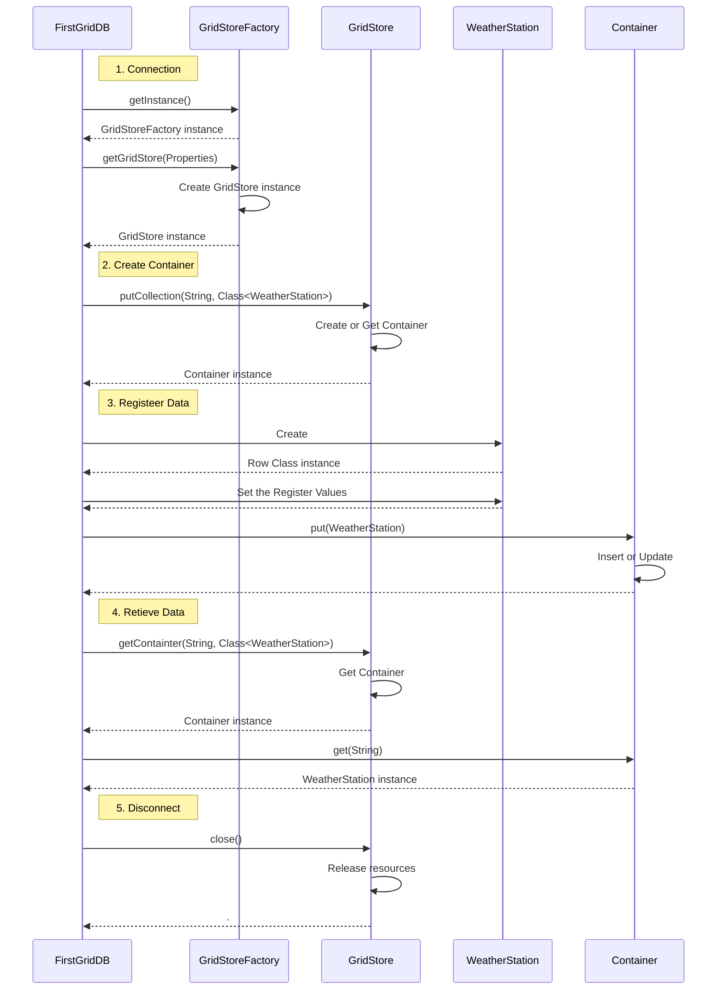

```mermaid
sequenceDiagram
  Note right of FirstGridDB: 1. Connection
  
  FirstGridDB->>GridStoreFactory: getInstance()
  GridStoreFactory-->>FirstGridDB: GridStoreFactory instance
  FirstGridDB->>GridStoreFactory: getGridStore(Properties)
  GridStoreFactory->>GridStoreFactory: Create GridStore instance
  GridStoreFactory-->>FirstGridDB: GridStore instance
  
  Note right of FirstGridDB: 2. Create Container
  
  FirstGridDB->>GridStore: putCollection(String, Class<WeatherStation>)
  GridStore->>GridStore: Create or Get Container
  GridStore-->>FirstGridDB: Container instance
  
  Note right of FirstGridDB: 3. Registeer Data
  
  FirstGridDB->>WeatherStation: Create
  WeatherStation-->>FirstGridDB: Row Class instance
  FirstGridDB->>WeatherStation: Set the Register Values
  WeatherStation-->>FirstGridDB: 
  FirstGridDB->>Container: put(WeatherStation)
  Container->>Container: Insert or Update
  Container-->>FirstGridDB: 
  
  Note right of FirstGridDB: 4. Retieve Data
  
  FirstGridDB->>GridStore: getContainter(String, Class<WeatherStation>)
  GridStore->>GridStore: Get Container
  GridStore-->>FirstGridDB: Container instance
  FirstGridDB->>Container: get(String)
  Container-->>FirstGridDB: WeatherStation instance
  
  Note right of FirstGridDB: 5. Disconnect
  
  FirstGridDB->>GridStore: close()
  GridStore->>GridStore: Release resources
  GridStore-->>FirstGridDB: .
```
